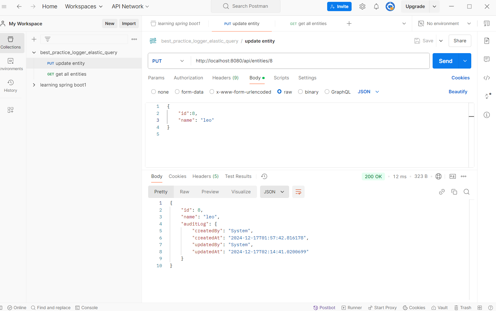
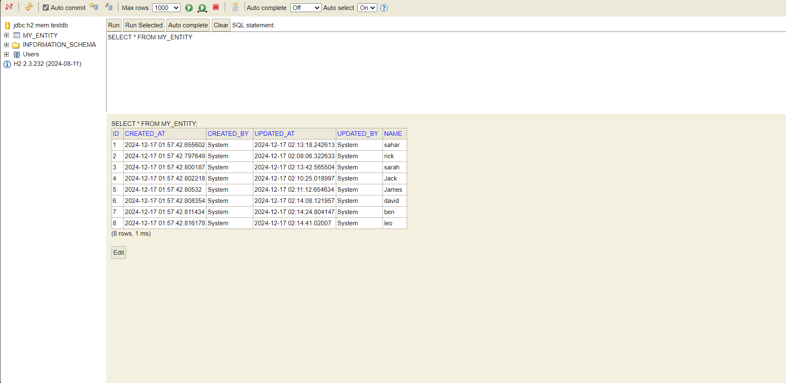

# Best Practice Logger Elastic Query

## Overview
This project implements a logging mechanism with best practices for tracking and auditing entity changes in a Spring Boot application. It leverages Elasticsearch for querying logs efficiently.

## Features
- **Entity Auditing**: Tracks changes to entities in the application.
- **Elastic Query Integration**: Supports querying logs using Elasticsearch.
- **Customizable**: Easily extendable for different entities and logging formats.

## Prerequisites
- Java 17
- Maven 3.6+
- Elasticsearch instance (local or remote)

## Installation

### Database Configuration
The project uses an in-memory H2 database for development and testing. The configuration for the database is located in `application.properties`:

```properties
# H2 Database configuration
spring.datasource.url=jdbc:h2:mem:testdb
spring.datasource.driverClassName=org.h2.Driver
spring.datasource.username=sa
spring.datasource.password=password
spring.h2.console.enabled=true
spring.h2.console.path=/h2-console
```

You can access the H2 console at:
```
http://localhost:8080/h2-console
```

Make sure to use the same `JDBC URL` as specified in the configuration.


1. Clone the repository:
   ```bash
   git clone <repository-url>
   cd best_practice_logger_elastic_query-master
   ```

2. Build the project:
   ```bash
   ./mvnw clean install
   ```

3. Configure `application.properties`:
   Update Elasticsearch connection settings:
   ```properties
   spring.elasticsearch.uris=http://localhost:9200
   spring.elasticsearch.username=<your-username>
   spring.elasticsearch.password=<your-password>
   ```

4. Run the application:
   ```bash
   ./mvnw spring-boot:run
   ```

## Usage

### Adding an Entity to Audit
1. Annotate your entity with `@Auditable`.
2. Ensure it is managed by a `JpaRepository`.

Example:
```java
@Auditable
@Entity
public class MyEntity {
    @Id
    @GeneratedValue
    private Long id;

    private String name;
    private String description;

    // Getters and Setters
}
```

### Accessing Logs
- Use the `AuditLogRepository` to query logs from Elasticsearch.

### API Endpoints
#### Example: Managing `MyEntity`
1. **Create Entity**
   ```bash
   POST /api/my-entity
   {
       "name": "Example Name",
       "description": "Example Description"
   }
   ```

2. **Update Entity**
   ```bash
   PUT /api/my-entity/{id}
   {
       "name": "Updated Name"
   }
   ```

3. **Fetch Logs**
   Query logs using the Elasticsearch interface or built-in APIs.

## Project Structure
```
best_practice_logger_elastic_query-master/
├── src/main/java/com/example/audit_log
│   ├── AuditLog.java
│   ├── AuditLogListener.java
│   ├── Auditable.java
│   ├── LoggerUtil.java
│   ├── MyEntity.java
│   ├── MyEntityController.java
│   └── MyEntityRepository.java
├── src/main/resources
│   └── application.properties
├── pom.xml
└── mvnw, mvnw.cmd
```

## Testing

### Sample Audit JSON Response
Below is a sample response for an audit log when fetching an entity:

```json
{
    "id": 1,
    "name": "sahar",
    "auditLog": {
        "createdBy": "System",
        "createdAt": "2024-12-17T02:29:37.553585",
        "updatedBy": "System",
        "updatedAt": "2024-12-17T03:29:59.952911"
    }
}
```
- Run unit tests:
  ```bash
  ./mvnw test
  ```

## Tools Used

### Postman
Postman was used for testing APIs interactively. Below is an example screenshot showing API requests and responses:



#### Available Endpoints in Postman
- **GET /api/entities/{id}**: Fetch a specific entity by ID.
- **PUT /api/entities/{id}**: Update a specific entity.
- **DELETE /api/entities/{id}**: Delete a specific entity.


### H2 Database
An in-memory H2 database was used for quick development and testing. The console can be accessed at:

```
http://localhost:8080/h2-console
```




## Contributing
Feel free to submit issues or create pull requests to contribute to this project.


